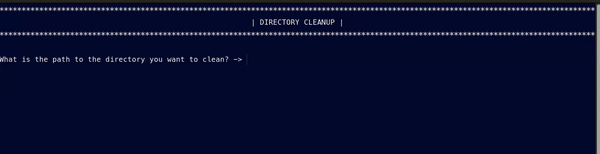

<div align="center">
  
# Directory Cleaner
####  Automates removal of all files from a specified location



     


------------


**| [Overview](#overview) | [Key Features](#key-features) | [User Manual](#user-manual) | [Ongoing Improvements and Known Bugs](#ongoing-improvements-and-known-bugs) | [Found a Bug?](#found-a-bug) |**


------------


## Overview
he script simplifies the task of cleaning up directories by automatically deleting all files within a specified folder. Before deletion occurs, the script confirms the directory's existence and prompts the user for validation, ensuring that no files are deleted without explicit consent.</p>


------------


## <center>Key Features</center>
##### <center>Targeted Cleanup</center>
###### <center>Allows users to specify the exact directory they want to clean up.</center>
##### <center>Validation of Directory Path
###### <center> Verifies that the provided path is valid and accessible before proceeding.</center>
##### <center>Automated Process</center>
###### <center>Once confirmed, the script efficiently deletes all files in the targeted directory.</center>
##### <center>No Accidental Deletions</center>
###### <center>The script requires explicit user consent before any deletion process begins..</center>


------------


## User Manual
</div>

####  Requirements

- You can use the `ls -ld` command to check the permissions of the directory:
```bash
$ ls -ld /path/to/directory
```
**Example Output:**
```bash
$ drwxr-xr-x 2 user group 4096 Sep 27 09:00 /path/to/directory
 ```
- You can adjust permissions using:
```bash
# Execution 
$ chmod +x /path/to/directory
# Writing - required for deleting files
$ chmod +w /path/to/directory
# Together
$ chmod +xw /path/to/directory
 ```


#### Getting Started
###### To run a program, you need to:
- Clone this repository
 ```bash
$ git clone <repository_url>
```
- Go into the repository
 ```bash
$ cd <repository_folder>
```

- Ensure that you have appropriate exectution permissions. You can adjust permissions using:
```bash
 $ .chmod +x del_dir_content.sh
 ```
-   Run the script by typing:
 ```bash
 $ ./del_dir_content.sh
 ```


#### Customization
###### Changing the Target Directory
The script prompts the user to specify the directory for cleanup at runtime. You can automate this by hardcoding the directory path if you always want to clean a specific folder without prompting for user input.

**To customize:**
```bash
# Replace the 'read' command with a specific directory path
$ path="/your/custom/directory/path"
```
###### File Extension Filter
If you only want to delete certain types of files (e.g., .log, .tmp files), you can modify the script to only remove files with specific extensions.

**Example:**
```bash
# To only delete .log files
$ rm -rf "$path"/*.log
```

------------
<div align="center">
  
## Ongoing Improvements and Known Bugs

##### So Far So Good


------------

## Found a bug?

If you encounter any issues or bugs while using this project, please feel free to open an issue in the Issues section of the repository. Make sure to describe the bug in detail, providing steps to reproduce, expected behavior, and any relevant logs or screenshots.

If you'd like to contribute a fix for the issue, you're welcome to submit a pull request (PR). When submitting a PR, please reference the issue number and provide a description of the changes made.

</div>

------------


