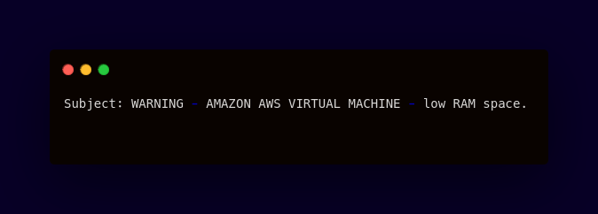

<div align="center">

# AWS RAM Watchdog
#### Automate memory checks




     


------------


**| [Overview](#overview) | [Key Features](#key-features) | [User Manual](#user-manual) | [Ongoing Improvements and Known Bugs](#ongoing-improvements-and-known-bugs) | [Found a Bug?](#found-a-bug) |**


------------


## Overview
This script monitors available RAM on AWS virtual machines and sends a notification email when memory falls below a threshold. Integrating it with crontab ensures regular memory checks at scheduled times, allowing for proactive memory management without manual execution.


------------


## Key Features
##### Custom Threshold
######  Users can set custom memory thresholds for triggering email alerts based on specific system requirements.
##### Integration with Crontab
###### Can be scheduled to run at regular intervals using crontab, automating the monitoring process without manual intervention.
##### Email Notification System
###### Sends email alerts when memory falls below a predefined threshold, keeping users informed in real-time.
##### Notification Customization
###### Users can easily adjust the subject and content of the email notifications.


------------


## User Manual
</div>

####  Requirements
######  Administrator (sudo) rights:
```bash
# Check if you have sudo privileges:
$ sudo -v
```
> **Note**
> If you are prompted for your password and no errors occur, you have sudo rights.


###### The `sendmail` utility
To check if the `sendmail` utility is installed on your system, you can use the following command:
 ```bash
$ sendmail -v
```
If  `sendmail ` is installed, this command will return the version of it. If it is not installed, you'll see an error message indicating that the command is not found.

> Alternatively, you can use the `which` or `command -v`  to check its availability.

If `sendmail` is not installed, you can install it using your system's package manager:

- On **Ubuntu/Debian**:
```bash
$ sudo apt install sendmail
```
- On **CentOS/RHEL**:
```bash
$ sudo yum install sendmail
```
- On **Fedora**:
```bash
$ sudo dnf install sendmail
```
- On **macOS** (if necessary, although it often comes pre-installed):
```bash
$ brew install sendmail
```

#### Getting Started
###### To run a program, you need to:
- Clone this repository
 ```bash
$ git clone <repository_url>
```
- Go into the repository
 ```bash
$ cd <repository_folder>
```

- Ensure that you have appropriate exectution permissions. You can adjust permissions using:
```bash
 $ .chmod +x email_alert.sh
 ```
-   Run the script by typing:
 ```bash
 $ ./email_alert.sh
 ```


#### Automating with Crontab
###### Schedule the script to run automatically using crontab:
1. Open the crontab configuration by typing:
 ```bash
crontab -e
 ```
2. Add the following line to schedule the script to run (for example ) every hour:
```bash
0 * * * * /path/to/email_alert.sh
```
3. Save and exit the editor. The script will now check the RAM usage every hour and send an email if the threshold is breached.

------------

<div align="center">

## Ongoing Improvements and Known Bugs

| # | Name               | Type | Description                                                                                                                                               |
|---|--------------------|------|-----------------------------------------------------------------------------------------------------------------------------------------------------------|
| 1 | Older Linux Distro | Bug  | The script may has compatibility issues with older Linux distributions that do not support the  `free -gt` option. It could throw errors on such systems. |


------------

## Found a bug?

If you encounter any issues or bugs while using this project, please feel free to open an issue in the Issues section of the repository. Make sure to describe the bug in detail, providing steps to reproduce, expected behavior, and any relevant logs or screenshots.

If you'd like to contribute a fix for the issue, you're welcome to submit a pull request (PR). When submitting a PR, please reference the issue number and provide a description of the changes made.


------------


