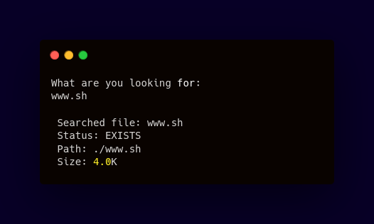
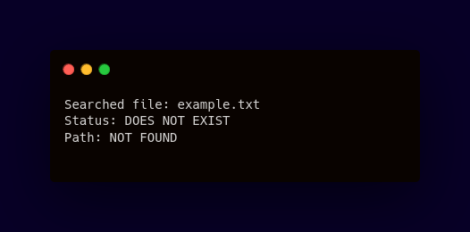

<div align="center">

# File Locator
#### File searching within a directory and subdirectories




     


------------


**| [Overview](#overview) | [Key Features](#key-features) | [User Manual](#user-manual) | [Ongoing Improvements and Known Bugs](#ongoing-improvements-and-known-bugs) | [Found a Bug?](#found-a-bug) |**


------------


## Overview
This Bash script helps users quickly search for a specific file within the current directory. Upon locating the file, it delivers essential information such as the file’s path and size. If the file does not exist, the script provides feedback about the absence of the file.


------------


## Key Features
##### Automated Search Process
###### Searches for a file within the current directory and subdirectories based on user input.
##### Status Feedback
###### Provides clear feedback about whether the file exists or not in the directory.
##### Human-Readable 
###### Displays the size of the found file in a user-friendly format using the `du` command.


------------


## User Manual
</div>

#### Prerequisites
Ensure that the following are installed on your system:
- Bash shell (`/bin/bash`)
 ```bash
$ which bash
```
> **Note**
> Output typically shows `/bin/bash` or `/usr/local/bin/bash` if Bash was installed via Homebrew on macOS

####  Setup
- Clone this repository
 ```bash
$ git clone <repository_url>
```
- Go into the repository
 ```bash
$ cd <repository_folder>
```
- Make it executable
 ```bash
$ chmod +x file_exists.sh
```

####   Features and Usage
- Run the file

  To run the script, execute:
```bash
$ ./file_exists.sh
```


######  File Name
After running the script, you will be prompted to enter the name of the file you want to search for:


Type the exact name of the file you want to locate (including the extension if applicable) and press`Enter`.


###### Output
If the file exists, you will see a message like this:


If the file does not exist, you will see this message:




------------

## <div align="center">Ongoing Improvements and Known Bugs</div>
| # | Name              | Type | Description                                                                                                                                                                                                     |
|---|-------------------|------|-----------------------------------------------------------------------------------------------------------------------------------------------------------------------------------------------------------------|
| 1 | Permission Issues | Bug  |  In cases where files have restricted permissions, the script may not be able to access or display their size and path information. This can lead to misleading feedback that suggests the file does not exist. |

------------

## <div align="center">Found a bug?</div>

If you encounter any issues or bugs while using this project, please feel free to open an issue in the Issues section of the repository. Make sure to describe the bug in detail, providing steps to reproduce, expected behavior, and any relevant logs or screenshots.

If you'd like to contribute a fix for the issue, you're welcome to submit a pull request (PR). When submitting a PR, please reference the issue number and provide a description of the changes made.


------------


