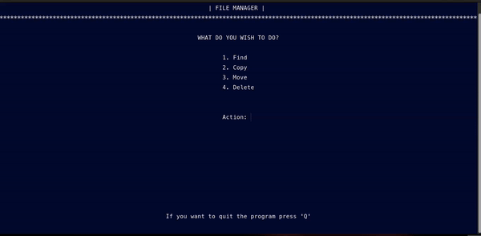

<div align="center">

# File Manager
#### <center> Providing user with the ability to perform a wide range of file operations</center>




     


------------


**| [Overview](#overview) | [Key Features](#key-features) | [User Manual](#user-manual) | [Ongoing Improvements and Known Bugs](#ongoing-improvements-and-known-bugs) | [Found a Bug?](#found-a-bug) |**


------------


## Overview
This Bash-based script offers powerful file management capabilities, making it easy to search for files across the system, view detailed information and perform operations like copying, moving, and deleting. With real-time feedback and confirmation prompts, it safeguards against accidental actions, ensuring that user can operate securely and efficiently in their Linux environment.


------------


## Key Features
##### Path Assistance
###### Assists in locating files or directories if there is no knowledge of the exact path.
##### Search Responses
###### Automatically displays all files matching the search criteria, giving users a clear list to select from.
##### Batch Operations
###### Supports multiple file operations, enabling users to copy, move, or delete multiple files simultaneously.
##### Personalizable Actions<
###### Users can choose to perform operations like copying or moving files either in the same directory or to a different destination and rename it.
##### Export
###### Allows users to export detailed file information, such as size and path, to external logs for reference or documentation.


------------


## User Manual

</div>

#### Prerequisites
Ensure that the following are installed on your system:
- Bash shell (`/bin/bash`)
 ```bash
$ which bash
```
> **Note**
> Output typically shows `/bin/bash` or `/usr/local/bin/bash` if Bash was installed via Homebrew on macOS

####  Requirements

- External script

  The script relies on an external file called `functions_library` located in the repository. Ensure this file exists in the correct location:
```bash
# Check if the external file exists in the same directory as the script:
$ ./functions_library  && echo "functions_library exists" || echo "functions_library is missing"
```
> **Note**
> Output of the command should be: `functions_library exists`

####  Setup
- Clone this repository
 ```bash
$ git clone <repository_url>
```
- Go into the repository
 ```bash
$ cd <repository_folder>
```
- Make it executable
 ```bash
$ chmod +x files_manager.sh
```

####   Features and Usage
- Run the file

  To run the script, execute:
```bash
$ ./files_manager.sh
```


######  Main Menu
After launching the File Manager, the following options are available:
- **Find:** Search for files in the system.
- **Copy**: Copy single or multiple files.
- **Move**: Move single or multiple files.
- **Delete**: Delete single or multiple files.
- **Quit**: Exit the program.

Navigate the menu by typing the corresponding number and pressing `Enter`.

###### Finding Files
**Single File**:
- Select the `Find` option followed by `Single File`.
- Enter the file name and the script will search the entire system for matches.
- If multiple files are found, select the one you want from a numbered list.
- Detailed file information such as size, type, and permissions will be displayed.

**Multiple Files**:
- Choose the `Find` option followed by `Multiple Files`.
- Enter multiple file names separated by spaces. The system will search for all the files and display their information.
- You can choose to export the file details to a log file.

###### Moving Files
**Single File:**
- Select the `Move` option, and choose `Single File`.
- Search for the file, and after locating it, specify the destination directory to move the file.

**Multiple Files:**
- Choose `Move`, followed by `Multiple Files`.
- Enter the names of the files to be moved and provide the target directory for the move.

###### Deleting Files
**Single File:**
- Select `Delete` and choose `Single File`.
- Search for the file and confirm whether you want to delete it.

**Multiple Files:**
- Choose `Delete`, followed by `Multiple Files`.
- Enter the names of the files to be deleted, confirm each deletion, or cancel the process if needed.

###### Exporting File Details
After finding files, the `File Manager` allows you to export the file details (such as size, type, permissions, and absolute path) to a text file. You will be prompted to confirm if you want to save this information at the end of the search process.

###### Quit
To quit the program, select the `Quit` option by typing `Q` and pressing `Enter`. Before exiting, the program will confirm if you’re sure about quitting:
1. Type `Yes` to quit the program.
2. Type `No` to return to the main menu.

#### Customization
###### Adjusting File Search Depth
By default, the script searches the entire system for files using the `find` command. You can limit the search depth by modifying the `find` command used in the `find_single` and `find_multi` functions. To limit the search depth, add the `-maxdepth` option to the find command. For example:

```bash
$ search_file=$(sudo find / -maxdepth 3 -type f -name "$file_name" 2>/dev/null)
```
> This will restrict the search to 3 directory levels deep.

###### Customizing Default Directories
You can set a default directory for searches, copies, or moves instead of searching the entire system. To customize this, update the path in the script to your desired default directory.

For example, in the `find_single` function, you can change this:
```bash
$ search_file=$(sudo find / -type f -name "$file_name" 2>/dev/null)
```
To this:
```bash
$ search_file=$(sudo find /home/user/documents -type f -name "$file_name" 2>/dev/null)
```
> This will limit searches to the specified directory.

------------

<div align="center">

## Ongoing Improvements and Known Bugs
| # | Name           | Type             | Description                                                                                                                                                                                     |
|---|----------------|------------------|-------------------------------------------------------------------------------------------------------------------------------------------------------------------------------------------------|
| 1 | Search Filters | Work in progress | A feature under development to allow users to filter search results based on file size, type, creation/modification dates, or other metadata, making file searches more targeted and efficient. |
| 2 | Backup         | Work in progress | Introducing a feature where files are automatically backed up to a temporary directory before deletion, giving users the option to restore files if deletion was accidental.                    |
| 3 | File Preview   | Work in progress | A feature that will enable users to preview the contents of files directly within the terminal before copying, moving, or deleting them, especially useful for text files.                      |

------------

## Found a bug?

If you encounter any issues or bugs while using this project, please feel free to open an issue in the Issues section of the repository. Make sure to describe the bug in detail, providing steps to reproduce, expected behavior, and any relevant logs or screenshots.

If you'd like to contribute a fix for the issue, you're welcome to submit a pull request (PR). When submitting a PR, please reference the issue number and provide a description of the changes made.

</div>

------------


