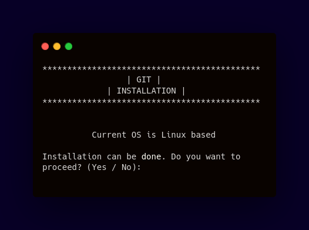

<div align="center">

# Git Installer
#### Automating the software installation 




     


------------


**| [Overview](#overview) | [Key Features](#key-features) | [User Manual](#user-manual) | [Ongoing Improvements and Known Bugs](#ongoing-improvements-and-known-bugs) | [Found a Bug?](#found-a-bug) |**


------------


## Overview
This script automates the process of installing `Git` on Linux-based distributions and macOS. It detects the operating system and ensures that program is not already installed, preventing redundant installations. If necessary, it installs the software using the appropriate package manager for the detected OS, and provides feedback throughout the process.


------------


## Key Features
##### Automated OS Detection
###### The script automatically detects the user's operating system and chooses the appropriate installation method based on that information.
##### Pre-Installation Check
###### Before installing, the script checks if `Git` is already installed on the system, preventing redundant installations.
##### User Confirmation
###### Before proceeding with the installation, the script prompts the user for confirmation, allowing them to decide whether or not to continue.
##### Clear Output
###### The script provides clean and structured output, allowing the user to easily follow the installation process and see the results.
##### Integration
###### The script integrates smoothly with other system processes, making it ideal for use in automated setups or DevOps pipelines.


------------


## User Manual
</div>

####  Requirements
- External script

  The script relies on an external file called `functions_library` located in the repository. Ensure this file exists in the correct location:
```bash
# Check if the external file exists in the same directory as the script:
$ ./functions_library  && echo "functions_library exists" || echo "functions_library is missing"
```
> **Note**
> Output of the command should be: `functions_library exists`

#### Getting Started
###### To run a program, you need to:
- Clone this repository
 ```bash
$ git clone <repository_url>
```
- Go into the repository
 ```bash
$ cd <repository_folder>
```

- Administrator (sudo) rights:
```bash
# Check if you have sudo privileges:
$ sudo -v
```
> **Note**
> If you are prompted for your password and no errors occur, you have sudo rights.

- Ensure that you have appropriate exectution permissions. You can adjust permissions using:
```bash
 $ .chmod +x git_installer.sh
 ```
-   Run the script by typing:
 ```bash
 $ ./git_installer.sh
 ```


#### Script Behavior
- **If `Git` is already installed:** The script will notify the user and exit without making changes.
- **If `Git` is not installed:** The script will prompt the user for permission to install and then proceed accordingly.
- **Unsupported OS:** The script will display an error message if it detects an unsupported operating system.

------------
<div align="center">


## Ongoing Improvements and Known Bugs

| # | Name                  | Type             | Description                                                                                                                                                   |
|---|-----------------------|------------------|---------------------------------------------------------------------------------------------------------------------------------------------------------------|
| 1 | Non-Root Installation | Work in progress | Introducing a non-root installation option for users who don’t have sudo privileges by downloading and compiling `Git` from source.                           |
| 2 | Permission Issues     | Bug              | Users on macOS may encounter permission issues when Homebrew isn’t set up with the correct permissions. A fix will be considered for automating this process. |


------------

## Found a bug?

If you encounter any issues or bugs while using this project, please feel free to open an issue in the Issues section of the repository. Make sure to describe the bug in detail, providing steps to reproduce, expected behavior, and any relevant logs or screenshots.

If you'd like to contribute a fix for the issue, you're welcome to submit a pull request (PR). When submitting a PR, please reference the issue number and provide a description of the changes made.

</div>

------------


