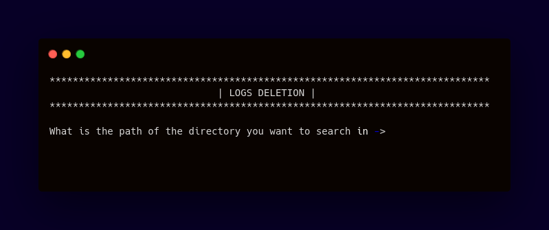

<div align="center">
  
# .Log Cleaner
####  Automates removal of all files from a specified location




     


------------


**| [Overview](#overview) | [Key Features](#key-features) | [User Manual](#user-manual) | [Ongoing Improvements and Known Bugs](#ongoing-improvements-and-known-bugs) | [Found a Bug?](#found-a-bug) |**


------------


## Overview
This script automates the cleanup of old log files from a user-specified directory, targeting files older than 30 days. Before deleting, the user is prompted for confirmation, ensuring safety. It is designed to efficiently free up disk space by managing log files while providing clear feedback and error handling.


------------


## Key Features
##### <center>User-Specified Directory</center>
###### <center>Searches for log files across the entire directory, ensuring no old or unwanted logs are left behind.</center>
##### <center>File Age Criteria
###### <center>It only targets log files older than 30 days for deletion, ensuring that recent files are preserved..</center>
##### <center>Automated Log Detection</center>
###### <center>The script automatically identifies `.log` files in a specified directory for cleanup.</center>
##### <center>Safety Mechanism</center>
###### <center>Before deleting any files, the script asks for user confirmation, preventing accidental file removal.</center>


------------


## User Manual
</div>

#### Requirements

- You can use the `ls -ld` command to check the permissions of the directory:
```bash
$ ls -ld /path/to/directory
```
**Example Output:**
```bash
$ drwxr-xr-x 2 user group 4096 Sep 27 09:00 /path/to/directory
 ```
- You can adjust permissions using:
```bash
# Execution 
$ chmod +x /path/to/directory
# Writing - required for deleting files
$ chmod +w /path/to/directory
# Together
$ chmod +xw /path/to/directory
 ```


#### Getting Started
###### To run a program, you need to:
- Clone this repository
 ```bash
$ git clone <repository_url>
```
- Go into the repository
 ```bash
$ cd <repository_folder>
```

- Ensure that you have appropriate exectution permissions. You can adjust permissions using:
```bash
 $ .chmod +x old_log_del.sh
 ```
-   Run the script by typing:
 ```bash
 $ ./old_log_del.sh
 ```


#### Customization
###### Adjusting the Time Period
The script currently searches for files older than 30 days using the `-mtime +30` flag. You can change this to search for files of a different age.

Current Code:
 ```bash
$ files=$(find "$path" -name "*.log" -mtime +30)
 ```
To search for files older than 7 days:
 ```bash
$ files=$(find "$path" -name "*.log" -mtime +7)
 ```
Alternatively, if you want to delete files older than a specific number of hours, use the -mmin option. For example, for files older than 24 hours:
 ```bash
$ files=$(find "$path" -name "*.log" -mmin +1440)
 ```
------------
<div align="center">

## Ongoing Improvements and Known Bugs

##### So Far So Good


------------

## Found a bug?

If you encounter any issues or bugs while using this project, please feel free to open an issue in the Issues section of the repository. Make sure to describe the bug in detail, providing steps to reproduce, expected behavior, and any relevant logs or screenshots.

If you'd like to contribute a fix for the issue, you're welcome to submit a pull request (PR). When submitting a PR, please reference the issue number and provide a description of the changes made.

</div>

------------

