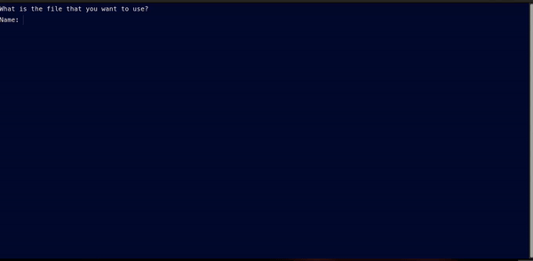

<div align="center">

# Contact Manager
#### Manage CRUD operations and track people’s contact details



     


------------


**| [Overview](#overview) | [Key Features](#key-features) | [User Manual](#user-manual) | [Ongoing Improvements and Known Bugs](#ongoing-improvements-and-known-bugs) | [Found a Bug?](#found-a-bug) |**


------------


## Overview
The Contact Manager is a command-line program that allows you to easily store and manage contact information like names, addresses, and phone numbers.The program uses a simple file to store data, providing an easy way to access and modify contacts without needing a complex database system.


------------


## Key Features
##### No Database Required
###### All contact details are saved in a simple text file, ensuring portability across systems.
##### Simple Interface
###### The program uses a menu-based system that is easy to navigate.
##### Customizable File
###### The user can specify the name of the file to store contacts, and the program will create the file if it does not exist.
##### Cross-Session Availability
###### Contacts remain stored and accessible even after the program is closed.
##### CRUD Operations
###### Full support for Create, Read, Update, and Delete operations, enabling easy management of contact data.


------------


## User Manual
</div>

####  Requirements
- External script

  The script relies on an external file called `functions_library` located in the repository. Ensure this file exists in the correct location:
```bash
# Check if the external file exists in the same directory as the script:
$ ./functions_library  && echo "functions_library exists" || echo "functions_library is missing"
```
> **Note**
> Output of the command should be: `functions_library exists`

#### Getting Started
###### To run a program, you need to:
- Clone this repository
 ```bash
$ git clone <repository_url>
```
- Go into the repository
 ```bash
$ cd <repository_folder>
```
- Ensure that you have appropriate exectution permissions. You can adjust permissions using:
```bash
 $ .chmod +x contact_manager.sh
 ```
-   Run the script by typing:
 ```bash
 $ ./contact_manager.sh
 ```
 Upon starting, you’ll be prompted to specify the file where contact data will be stored. If the file doesn’t exist, you’ll be given the option to create it. Ensure the file has write permissions. If the file is not writable, the program will notify you and exit.

#### Features and Usage
######  Main Menu
After starting the program, you’ll be presented with the main menu. You can select an option by typing the corresponding letter (case-insensitive).
```bash
                                                | CONTACT MANAGER |
                                                      WELCOME!
                         
				  PLEASE CHOOSE A SUITABLE OPTION FROM BELOW:

                                                    C-reate
                                                    V-iew
                                                    S-earch
                                                    D-elete
                                                    Q-uit
 ```

###### Create
1. Select the Create option by typing `C` and pressing `Enter`.
2. You will be prompted to enter the contact details one by one (e.g., first name, surname, address, etc.).
3. Once the details are entered, the program will display the record for confirmation.
4. You can confirm by typing `Yes` or cancel by typing `No`.
5. If confirmed, the contact will be saved to the file. You will also be asked if you'd like to add another contact.

###### View
1. Select the `View` option by typing `V` and pressing `Enter`.
2. The program will display all the contacts currently stored in the file in a formatted table with headers.
3. If no contacts are available, the program will inform you that the contact list is empty.

###### Search
1. Select the Search option by typing `S` and pressing `Enter`.
2. Enter a keyword or pattern to search for (e.g., part of a name, city, etc.).
3. The program will display all records that match the search pattern.
4. If no records are found, you will be informed that no matching contacts exist.

###### Delete
1. Select the `Delete` option by typing `D` and pressing `Enter`.
2. The program will first perform a search to find the contact(s) you wish to delete.
3. After displaying the search results, you will be prompted to confirm the deletion.
4. If confirmed, the selected contact(s) will be deleted from the file.
5. You will also have the option to delete all records if needed.

###### Quit
To quit the program, select the `Quit` option by typing `Q` and pressing `Enter`. Before exiting, the program will confirm if you’re sure about quitting:
1. Type `Yes` to quit the program. 
2. Type `No` to return to the main menu.


#### Customization
###### Data Storage Location

By default, the program asks for a file name to store contact information. You can customize this behavior to set a default file location or avoid repeated prompts.

**Steps to Set a Default File Location:**

1. Open the `contact_manager.sh` script in a text editor.
2. Locate the section that asks for the file name:
```bash
$ echo -e "What is the file that you want to use?"
$ read -p "Name: " fname
```
3. Replace this section with a predefined file path, so the program automatically uses a specific file:
```bash
$ fname="/path/to/default/contact_file.txt"
```
Now, the program will always use the specified file, bypassing the need for user input.


###### Contact Format
The default contact format includes fields like first name, surname, address, and so on. You can customize the fields to match your specific use case (e.g., adding phone numbers, email addresses).

**Steps to Add Custom Fields:**

1. In the `create()` function, you can add prompts for additional information:
```bash
$ read -p "Phone Number: " phone
$ read -p "Email Address: " email
```
2. Update the file-writing section to include the new fields:
```bash
$ echo $first_name:$surname:$address:$country:$city:$state:$zip_code:$phone:$email >> $fname
```
3. Modify the `header()` and `single_line()` functions to display the new fields in the contact list:
```bash
$ printf "%-14s %-16s %-25s %-15s %-15s %-18s %-15s %-15s %-25s\n" \
"First Name" "Surname" "Address" "Country" "City" "State" "Zip Code" "Phone" "Email"
```

------------

## <div align="center">Ongoing Improvements and Known Bugs</div>

| **#** | **Name**                           | **Type**         | **Description**                                                                                                                                      |
|:-----:|:----------------------------------:|:----------------:|:----------------------------------------------------------------------------------------------------------------------------------------------------:|
| 1     | Improved Search Capabilities       | Work in progress | Adding advanced search filters, such as searching by specific fields like city or zip code.                                                          |
| 2     | Backup Functionality               | Work in progress |  Implementing a backup system to store copies of the contact file before deletion or major updates.                                                  |
| 3     | Interactive Record Editing         | Work in progress |  Allow users to modify existing contact records                                                                                                      |
| 4     | Bulk Operations                    | Work in progress |  Implementing adding or deleting multiple contacts at once.                                                                                          |
| 5     | Export                             | Work in progress | Adding the ability to export contacts in different formats, such as CSV or JSON.                                                                     |
| 6     | Accidental Deletion of All Records | Bug              | In the `delete()` function, if no search pattern is provided and the user confirms the deletion, all records may be deleted without a clear warning. |


------------

## <div align="center">Found a bug?</div>
<p align="center">
If you encounter any issues or bugs while using this project, please feel free to open an issue in the Issues section of the repository. Make sure to describe the bug in detail, providing steps to reproduce, expected behavior, and any relevant logs or screenshots.

If you'd like to contribute a fix for the issue, you're welcome to submit a pull request (PR). When submitting a PR, please reference the issue number and provide a description of the changes made.
</p>

------------

